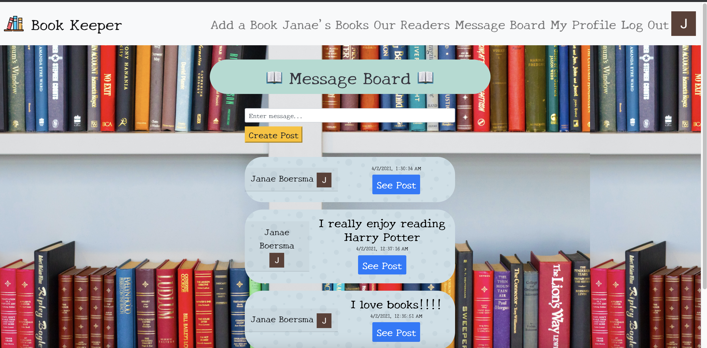

# The Book Keeper App
### Where you keep track of the books you've read

## Description:
This app helps you keep track of the books you've recently read. You add the book title and author and can check the box on if you've read it before. You can also add your own rating and make updates to your book title and author. 

# Getting Started
[Here is a link to my trello board](https://trello.com/b/qSS3tFc7/book-keeper)

[Here is a link to my project](https://book-app-jb.herokuapp.com/)

# Screenshots

Here's the welcome page for Book Keeper when you first go to the app.

This is the first page the user sees when they log in.  It will be populated with the books they add but for now has a button that will lead them to the add a book page.

A user can type in the title and author's name of the latest book they have read.  It will then get added to their book list.

This is what the book list page looks like after a user has added some of their latest books.

You can leave a review or update your book on this page.  You can also delete your review if you'd like to change it.

This is what everyone's profile page looks like with their unique information.

This page shows all of the users who have logged into the app.

Here's the message board page where anyone can write a post.  All users can see all of the posts.

When you click on a message, these are the details of the message and where you can reply to a certain message.

# Technologies Used:
* Node.js
* Express
* MongoDB
* Mongoose
* JavaScript
* HTML
* CSS
* EJS
* Google OAuth
* Heroku
* Bootstrap
* Pure CSS
* FontAwesome
* Hero Patterns

## Credits:
* Icons made by Freepik from www.flaticon.com 
* Background vector created by pikisuperstar - www.freepik.com</a> 
* error image from literallydarling.com
* images from deviant art 

# Next Steps:
* Ability to create multiple lists
* Use an API
* Make friends with other users
* Show the book lists in each user's profile and be able to view other books and reviews
* A button that let's people say their overall impression
* Create joint lists with others

